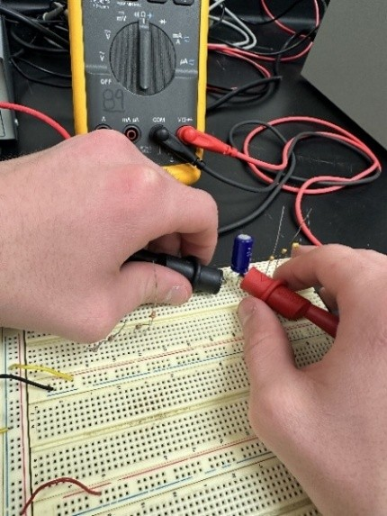

# BAE305-SP25-Lab1
# Lab Report: Lab 1 - Knowing Your Instruments

 

## Names of People Involved

Quinn Rison, Faith Cox

 

## Submission Date

2/3/25

 

## Introduction

Our project goal was to begin using the equipment that we will continue working with throughout the semester. We started by measuring different resistors, voltages, and capacitor values and comparing them to their expected values with a multimeter. To supply voltages, we used the DCPS (Direct Current Power System) and measured with the multimeter. Additionally, we used an oscilloscope to observe different frequencies output from the function generator.

 

Our results showed that measured values typically deviate slightly from expected values due to component tolerances. However, some measurements were significant outliers. The oscilloscope provided easier measurements due to its built-in dials and graphical display.

 

## Methods/Tests

### Measuring Capacitor with Multimeter

- 

- 

- 

- 

- 

 

## Results

### Resistor Measurements

| Resistor Label | Color Sequence | Expected Resistance (Ω) | Expected Min (Ω) | Expected Max (Ω) | Measured Resistance (Ω) |
|----------------|----------------|-------------------------|------------------|------------------|-------------------------|
| R1 | Red, Red, Gold, Gold | 2.2 | 2.09 | 2.31 | 3.4 |
| R2 | Brown, Violet, Brown, Gold | 170 | 161.5 | 178.5 | 101.0 |
| R3 | Red, Red, Green, Gold | 22E6 | 2.09E6 | 2.31E6 | 2.220M |
| R4 | Orange, Orange, Red, Gold | 3300 | 3135 | 3465 | 3300 |

 

### Capacitor Measurements

| Capacitor Label | Expected Capacitance (F) | Expected Min (F) | Expected Max (F) | Measured Capacitance (F) | In Spec? (Y/N) |
|-----------------|--------------------------|------------------|------------------|--------------------------|----------------|
| C1* | 100µ | FILL OUT | FILL OUT | 0µ | Y |
| C2  | 10E2p | 0.9n | 1.1n | 1.40n | N |
| C3  | 22n | 20.9n | 23.1n | 0.41n | N |
| C4  | 231 | 0.8µ | 1.8µ | 1.21µ | Y |

 

> *The Fluke Multimeter could not measure past 100µF; the capacitor is likely 101µF, but the tool automatically reads 0µF.*

 

### Voltage Output of DCPS

| Expected Voltage (V) | Measured Voltage (V) |
|----------------------|----------------------|
| 1.5 | 1.49 |
| 7.0 | 7.01 |
| 12.0 | 12.01 |

a. Do the instruments agree with the expected value?

C1 and C4 measured capacitances seem to agree with the expected results. Though C1 had measurement issues as stated under the table, it can be inferred it would meet the expected values. For C2 and C3, these are not in spec of our expected results, even with their tolerances

b. Does polarity affect the measurement of the electrolytic capacitor?

Yes, polarity can significantly impact the capacitance readings. If a measurement is done using the incorrect polarity, it could damage the capacitor or cause incorrect readings. Looking at our measured data, this could be the reason our C2 and C3 readings were off and not compliant with the expected results. 

**Auxiliary Outputs:**

| Output | Expected (V) | Measured (V) |
|--------|--------------|--------------|
| Aux 2 | 12.0 | 11.99 |
| Aux 1 | 5.0 | 5.18 |

Discussion Question 1: Do the instruments agree with each other? Why?
Yes, the voltage on the power supply is equal to the measured voltage for all three voltage examples.
 

### Function Generator Output

| Measurement Method | Measured Frequency (Hz) | Measured Amplitude (V) |
|--------------------|-------------------------|------------------------|
| Counting Squares | 2000 | 6.0 |
| Moveable Cursors | 1953.125 | 6.32 |
| Oscilloscope Features | 2089.86 | 6.24 |
| Fluke DMM | 2089 | 0.087 |

Discussion Question 2: Do the instruments agree? Why?

The first three procedures provided similar measure results, but the Fluke DMM readings were the outlier. This could have occurred due to the Fluke DMM’s readings being less precise than the oscilloscope’s. This is because the Fluke DMM takes average measurements overtime, which could change the curve and differ them from the other 3 methods. 

 

## Conclusion

From our measurements, we observed that resistors and capacitors generally stayed within expected tolerance ranges, but some values deviated significantly. Voltage outputs from the DCPS were very accurate. Function generator frequency measurements were consistent, except for the Fluke DMM, which showed lower accuracy due to averaging effects. The oscilloscope provided the most precise frequency measurements.

